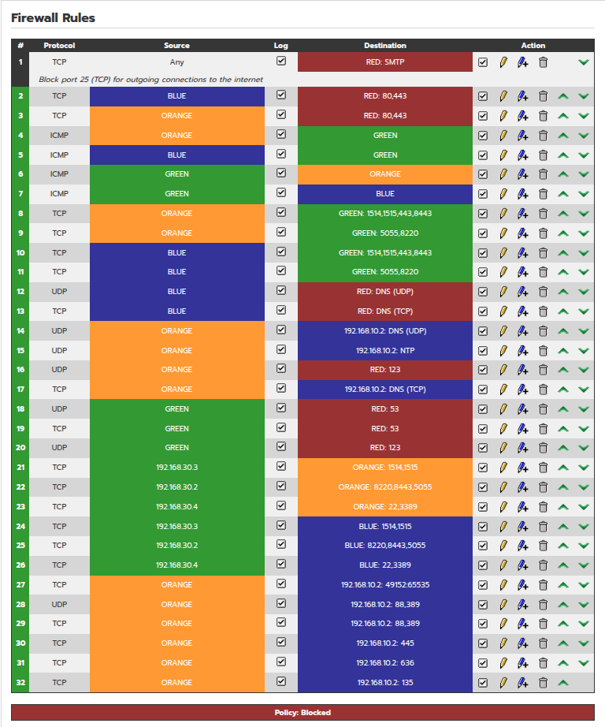

# 🏢 Enterprise Security Lab — Full-Stack Cyber Defense Simulation

> Designed, built, and operated a fully segmented virtual enterprise environment from scratch on constrained hardware — simulating the infrastructure, tooling, and security operations of a real organization.
>
> This is not a guided tutorial lab. Every architectural decision, firewall policy, network segment, and tool integration was researched, implemented, and debugged independently — reflecting the same problem-solving required in a professional security role.
>
> **Skills demonstrated:** Enterprise network architecture · Firewall policy design (default-deny, zone segmentation) · SIEM/EDR deployment and agent management · Network traffic analysis · Active Directory administration · Log correlation · Incident response workflow · Linux/Windows system administration · Documentation

---

## 📖 Table of Contents

- [Overview](#overview)
- [Lab Architecture](#lab-architecture)
- [Phase 1 – Infrastructure & Security Foundation](#phase-1--infrastructure--security-foundation)
  - [Network Segmentation](#network-segmentation)
  - [VM Components & Resource Constraints](#vm-components--resource-constraints)
  - [Network Zones & IP Assignment](#network-zones--ip-assignment)
  - [VirtualBox Network Configuration](#virtualbox-network-configuration)
  - [Firewall Configuration](#firewall-configuration)
  - [Active Directory & Identity Infrastructure](#active-directory--identity-infrastructure)
  - [Agents Deployment](#agents-deployment)
  - [Initial Setup & Challenges](#initial-setup--challenges)
- [Phase 2 – Detection Engineering & Attack Simulation (In Progress)](#phase-2--detection-engineering--attack-simulation-in-progress)
- [Phase 3 – Automation & Response (Planned)](#phase-3--automation--response-planned)
- [How to Replicate](#how-to-replicate)
- [Lessons Learned](#lessons-learned)
- [Future Roadmap](#future-roadmap)
- [License & Acknowledgements](#license--acknowledgements)

---

## Overview

Most cybersecurity home labs focus on a single tool or a pre-built scenario. This project takes a different approach — building a **complete enterprise simulation** that mirrors what a real organization's infrastructure looks like, including the complexity, constraints, and trade-offs that come with it.

The environment runs entirely on a single physical host (16 GB RAM, 500 GB external HDD) and emulates a small enterprise with:

- **Perimeter firewall with zone-based segmentation** (IPFire) — default-deny policy, 32 explicit rules, all logged
- **Network Detection & Response** (Security Onion) — passive traffic capture via promiscuous mode on the server segment
- **Endpoint Detection & Response / SIEM** (Wazuh) — agents deployed across all endpoints, centralized alerting
- **Active Directory domain** (Windows Server 2019) — DC, DNS, NTP, and DHCP serving the enterprise environment
- **Realistic user and server zones** — domain-joined workstation, Linux server, Windows server
- **Dedicated management workstation** — isolated analyst access to all monitoring dashboards
- **External attacker machine** (Parrot OS) — internet-connected, simulating a real external threat actor

The project is structured in phases to reflect how enterprise security programs actually mature — foundation first, then detection, then automation.

---

## Lab Architecture


---

## Phase 1 – Infrastructure & Security Foundation

### Network Segmentation

IPFire acts as the perimeter firewall and router, enforcing strict zone-based segmentation. Each zone represents a distinct trust boundary — no traffic crosses zones without an explicit firewall rule.

| Zone | Purpose | Subnet | IPFire Interface |
|------|---------|--------|-----------------|
| **RED** | WAN / external attacker | 10.0.2.0/24 | RED |
| **GREEN** | Management & monitoring | 192.168.30.0/24 | GREEN |
| **BLUE** | Server zone (DC, victims) | 192.168.10.0/24 | BLUE |
| **ORANGE** | User zone (workstations) | 192.168.20.0/24 | ORANGE |

**Zone trust model:**
- **RED** is fully isolated inbound — no external traffic can initiate connections into any internal zone. Parrot OS accesses the internet directly via VirtualBox NAT, bypassing IPFire entirely, which accurately simulates an external attacker with internet access but no internal reach.
- **GREEN** has source-IP scoped access to BLUE and ORANGE — each monitoring tool has only the ports it requires.
- **BLUE** and **ORANGE** have explicit outbound internet access (80/443) and communicate with the DC for AD services. Cross-zone communication between BLUE and ORANGE is blocked.
- All traffic between zones is logged and forwarded to the SIEM.

### VM Components & Resource Constraints

All VMs run in VirtualBox on a host with **16 GB RAM** and **500 GB external HDD**. Because of hardware limits, a selective power-on strategy is used — not all VMs run simultaneously. Session planning determines which VMs are needed for a given task.

| VM | Role | vCPU | RAM (GB) | Storage (GB) | Zone | IP |
|----|------|------|----------|--------------|------|----|
| **IPFire** | Firewall / Router | 1 | 1 | 10 | – | DHCP on RED |
| **Security Onion** | NDR — network monitoring | 4 | 8 | 200 | GREEN | 192.168.30.2 |
| **Wazuh OVA** | EDR / SIEM | 4 | 8 | 50 | GREEN | 192.168.30.3 |
| **Ubuntu Desktop** | Management workstation | 2 | 4 | 25 | GREEN | 192.168.30.4 |
| **Windows Server 2019** | DC · AD · DNS · NTP · DHCP | 2 | 2 | 40 | BLUE | 192.168.10.2 |
| **Ubuntu Server** | Victim Linux server | 1 | 2 | 25 | BLUE | 192.168.10.3 |
| **Windows 10 LTSC** | Domain-joined user workstation | 2 | 2 | 40 | ORANGE | 192.168.20.2 |
| **Parrot OS** | External attacker | 2 | 4 | 40 | RED | DHCP (NAT) |

> **RAM note:** Security Onion and Wazuh OVA require their full RAM allocation during installation. After setup, allocations can be reduced slightly for day-to-day use depending on the session.

### Network Zones & IP Assignment

| Zone | VirtualBox Network | Subnet | Gateway | VMs |
|------|--------------------|--------|---------|-----|
| RED | `nat-wan` (NAT Network) | 10.0.2.0/24 | 10.0.2.1 | Parrot OS |
| BLUE | `zone-server` (Internal) | 192.168.10.0/24 | 192.168.10.1 | Windows Server, Ubuntu Server |
| ORANGE | `zone-user` (Internal) | 192.168.20.0/24 | 192.168.20.1 | Windows 10 |
| GREEN | `zone-monitoring` (Internal) | 192.168.30.0/24 | 192.168.30.1 | Security Onion, Wazuh, Ubuntu Desktop |

**Security Onion monitoring interface:**
Security Onion has a second adapter attached to `zone-server` (BLUE) with **promiscuous mode enabled** and no IP address. This passive capture interface sees all traffic on the server segment without being visible to hosts on that network.

### VirtualBox Network Configuration

#### IPFire (4 adapters)

| Adapter | Type | Network Name | IPFire Zone |
|---------|------|--------------|-------------|
| 1 | NAT Network | `nat-wan` | RED |
| 2 | Internal Network | `zone-server` | BLUE |
| 3 | Internal Network | `zone-user` | ORANGE |
| 4 | Internal Network | `zone-monitoring` | GREEN |

#### Security Onion (2 adapters)

| Adapter | Type | Network Name | IP | Promiscuous |
|---------|------|--------------|-----|-------------|
| 1 | Internal Network | `zone-monitoring` | 192.168.30.2 | Disabled |
| 2 | Internal Network | `zone-server` | None (capture only) | **Allow All** |

All other VMs have a single adapter attached to their respective zone network.

---

### Firewall Configuration

All inter-zone traffic is denied by default. Every permitted flow has an explicit rule with logging enabled. This ensures that firewall events are available for SIEM correlation and anomaly detection — a blocked connection attempt is just as valuable as a successful one.

#### Default Policy

| Chain | Policy | Rationale |
|-------|--------|-----------|
| Forward | **DROP** | All inter-zone traffic requires an explicit rule |
| Input | **DROP** | No unsolicited access to IPFire itself |
| Outgoing | **ALLOW** | IPFire-initiated traffic only — updates, NTP, DNS |

#### Port Reference

| Port(s) | Protocol | Purpose |
|---------|----------|---------|
| 25 | TCP | Blocked outbound — prevents mail exfiltration and spam relay |
| 22 | TCP | SSH — management workstation (`.30.4`) to BLUE/ORANGE only |
| 53 | UDP/TCP | DNS — primary to DC (`192.168.10.2`), internet fallback when DC is offline |
| 80, 443 | TCP | Outbound internet access for BLUE and ORANGE zones |
| 88 | UDP/TCP | Kerberos — Active Directory authentication |
| 123 | UDP | NTP — primary to DC, internet fallback when DC is offline |
| 135 | TCP | RPC endpoint mapper (AD) |
| 389 | UDP/TCP | LDAP — Active Directory queries |
| 445 | TCP | SMB — Group Policy and SYSVOL replication |
| 636 | TCP | LDAPS — encrypted LDAP |
| 1514 | TCP | Wazuh agent event forwarding |
| 1515 | TCP | Wazuh agent registration |
| 3389 | TCP | RDP — management workstation (`.30.4`) to BLUE/ORANGE only |
| 5055 | TCP | Logstash pipeline (Elastic Agent → Security Onion) |
| 8220 | TCP | Elastic Agent enrollment (Fleet Server) |
| 8443 | TCP | Fleet Server management (Security Onion) |
| 49152–65535 | TCP | RPC dynamic ports — required for AD operations |
| — | ICMP | Connectivity testing, scoped per zone direction |

#### Zone Access Matrix

| Source | Internet | GREEN | ORANGE | BLUE |
|--------|----------|-------|--------|------|
| **GREEN** | DNS/NTP only | — | Scoped per tool IP + ports | Scoped per tool IP + ports |
| **ORANGE** | 80/443 only | Agent ports only | — | DC IP only (AD ports) |
| **BLUE** | 80/443 + DNS fallback | Agent ports only | ❌ Blocked | — |
| **RED** | — | ❌ Blocked | ❌ Blocked | ❌ Blocked |

#### Firewall Rules Screenshot



#### Key Design Decisions

- **Default-deny enforced across all chains** — understanding every traffic flow in the environment was a prerequisite to implementing this. Every service had to be explicitly identified and justified before a rule was written.
- **All 32 rules are logged** — firewall events feed into Wazuh and Security Onion for correlation. A blocked port scan from RED is as detectable as malware on an endpoint.
- **GREEN is source-IP scoped, not zone-wide** — Wazuh (`.30.3`), Security Onion (`.30.2`), and the management workstation (`.30.4`) each have only the ports they require. A compromised management VM cannot freely pivot into BLUE or ORANGE on arbitrary ports.
- **AD domain traffic scoped to DC IP only** — Kerberos, LDAP, SMB, and RPC are permitted from ORANGE to `192.168.10.2` exclusively, not to the entire BLUE subnet. Ubuntu Server on BLUE is not reachable from ORANGE.
- **DNS/NTP resilience with tiered fallback** — primary DNS and NTP target the Domain Controller. When the DC is offline (common in a resource-constrained lab), fallback rules permit direct internet resolution to prevent log timestamp drift and name resolution failures on monitoring tools.
- **SMTP blocked at rule 1** — positioned before all other rules. No zone can send outbound email, preventing data exfiltration via mail relay regardless of other rule configurations.
- **RED fully isolated inbound** — Parrot OS has internet access through VirtualBox NAT directly, bypassing IPFire. This accurately models an external attacker. No rule permits RED to initiate connections into any internal zone.

---

### Active Directory & Identity Infrastructure

Windows Server 2019 (`192.168.10.2`) serves as the identity backbone of the enterprise simulation, running multiple infrastructure roles:

- **Active Directory Domain Services** — domain `corp.local`, organizational units for Servers, Workstations, Users, and Service Accounts
- **DNS Server** — authoritative for `corp.local`, forwarding external queries to `8.8.8.8`. All internal VMs use this as their primary DNS.
- **NTP authority** — domain-joined machines sync time to the DC. Linux VMs configured with DC as primary NTP and `pool.ntp.org` as fallback for when the DC is offline.
- **DHCP Server** — scope configured for the ORANGE zone (`192.168.20.10–100`), relayed via IPFire's DHCP relay feature

**AD structure includes:**
- Domain administrator account (privileged, not used for daily tasks)
- Standard user accounts representing enterprise employees
- A service account with an SPN (intentionally Kerberoastable for Phase 2 attack simulation)
- Windows 10 LTSC domain-joined to `corp.local`

**Time synchronization strategy:**
All Linux VMs (`/etc/systemd/timesyncd.conf`) are configured with:
```
NTP=192.168.10.2
FallbackNTP=pool.ntp.org
```
Before each attack simulation session, time is force-synced on all running VMs to ensure log timestamps are reliable for SIEM correlation.

---

### Agents Deployment

Agents were deployed on all endpoint VMs (Windows Server 2019, Ubuntu Server, Windows 10 LTSC) to enable centralized monitoring across both platforms:

- **Wazuh agents** installed on each endpoint, configured to communicate with the Wazuh manager at `192.168.30.3` (ports 1514/1515). All connections are agent-initiated (endpoints push to manager), which is reflected in the firewall rule direction.
- **Security Onion Elastic Agents** installed on each endpoint, enrolling with the Fleet Server at `192.168.30.2:8220` using the official MSI installer (Windows) and Linux installer. Ports 8220, 8443, and 5055 opened in IPFire between BLUE/ORANGE and GREEN.
- Security Onion web interface access was granted to the management VM using:
  ```bash
  sudo so-firewall includehost analyst 192.168.30.4
  sudo so-firewall apply
  ```

All endpoints forward logs and telemetry to both monitoring platforms simultaneously.

---

### Initial Setup & Challenges

Real enterprise deployments don't go smoothly — and neither did this one. Every challenge below was independently diagnosed and resolved:

| Challenge | Solution |
|-----------|----------|
| External HDD changes device name depending on USB port; VirtualBox refused to start VMs due to KVM conflict | Wrote `/starter` bash script — mounts HDD by UUID and disables Intel KVM at boot |
| Ubuntu netplan config lost after install across all VMs; Wazuh OVA defaulted to DHCP | Manually wrote `/etc/netplan/50-cloud-init.yaml` for Ubuntu VMs; edited `/etc/systemd/network/` for Wazuh OVA with static IP, gateway, and DNS |
| BLUE zone VMs had no internet access after default-deny policy applied | Identified missing explicit 80/443 rules for BLUE; added per-zone outbound rules |
| Switching to default-deny broke agent communication | Audited all agent traffic flows, mapped exact ports per tool, rebuilt ruleset from scratch with correct directions |
| AD domain join from ORANGE failed silently | Identified missing Kerberos (88), LDAP (389), SMB (445), RPC (135, 49152–65535) rules between ORANGE and DC IP |
| Wazuh manual installation repeatedly failed | Switched to official Wazuh OVA (pre-configured appliance) |
| Parrot OS live environment hung on boot | Removed ISO from VM virtual storage — it was booting into the installer loop |
| DNS resolution broken on Ubuntu VMs | Set `/etc/resolv.conf` manually and disabled `systemd-resolved` |
| Systemd service startup timeouts on resource-constrained VMs | Increased `DefaultTimeoutStartSec=600` in `/etc/systemd/system.conf` |
| `sudo so-firewall apply` repeatedly timed out — Salt configuration engine was stuck | Restarted Salt: `sudo systemctl restart salt-master salt-minion` |

**Config files:**
- [starter — bash script (HDD mount + KVM disable)](/starter)
- [50-cloud-init.yaml — static IP config for Ubuntu VMs](/50-cloud-init.yaml)
- [05-static-eth0.network — static IP config for Wazuh OVA](/05-static-eth0.network)

---

## Phase 2 – Detection Engineering & Attack Simulation (In Progress)

With the infrastructure foundation stable, Phase 2 focuses on generating realistic attack telemetry and validating that the detection stack actually catches it.

**Endpoint telemetry hardening (prerequisite):**
- [ ] Deploy **Sysmon** on Windows Server and Windows 10 using the SwiftOnSecurity configuration — adds process creation, network connection, and file creation events that Windows default auditing misses entirely
- [ ] Enable **Advanced Audit Policy** via Group Policy: logon events (4624/4625), process creation (4688), privilege use, account management
- [ ] Enable Windows Firewall logging on BLUE/ORANGE endpoints and forward to Wazuh

**Network baseline documentation:**
- [ ] Run environment cleanly for 24–48 hours with only legitimate activity
- [ ] Document normal traffic patterns in Security Onion (Zeek conn logs, expected protocols per zone, typical external destinations)
- [ ] Tune Suricata suppressions for known-good Windows/Microsoft traffic to reduce noise before attacks begin

**Attack simulation:**
- [ ] **Atomic Red Team** on Windows endpoints — simulate specific MITRE ATT&CK techniques (credential access T1003, execution T1059, persistence T1547) and verify Wazuh/Security Onion detections fire correctly
- [ ] **Kerberoasting** against the intentionally vulnerable service account in AD — validate detection via Windows event 4769 and Zeek Kerberos logs
- [ ] **Lateral movement** simulation between ORANGE and BLUE — test whether the firewall correctly blocks unauthorized paths and whether allowed paths generate detectable telemetry
- [ ] Document each attack with: technique used → expected alert → actual alert → gap analysis

**Incident response workflow:**
- [ ] Deploy **TheHive** on the management workstation as an additional service — practice creating IR cases, documenting evidence, and tracking investigation steps for each simulated attack

---

## Phase 3 – Automation & Response (Planned)

- Wazuh **active response** — automated actions triggered by specific alert conditions (e.g., block IP after repeated failed logins)
- **MISP** integration — connect threat intelligence feeds to Wazuh and Security Onion for IOC-based detection
- **Caldera** (MITRE adversary emulation) — run multi-step attack chains that go beyond single techniques, simulating a full intrusion lifecycle
- **Slack/Teams notifications** for critical severity alerts
- Elasticsearch ML anomaly detection on network baselines established in Phase 2

---

## How to Replicate

1. **Hardware requirements**
   - Minimum: 16 GB RAM, 500 GB storage, CPU with hardware virtualization (VT-x/AMD-V)
   - Plan for selective VM power-on — Security Onion (8 GB) and Wazuh (8 GB) together consume the full 16 GB allocation

2. **Software**
   - VirtualBox (or VMware Workstation)
   - ISOs/OVAs: IPFire, Security Onion, Wazuh OVA, Windows Server 2019 evaluation, Windows 10 LTSC evaluation, Ubuntu Server 24.04, Ubuntu Desktop 24.04, Parrot OS Security

3. **Deployment sequence**
   - IPFire first — establish zone connectivity before any other VM is configured
   - Security Onion → Wazuh OVA → Windows Server (AD/DNS setup) → other VMs
   - Configure static IPs before installing agents — IP changes after agent registration cause re-enrollment issues

4. **Network configuration**
   - Create internal networks in VirtualBox: `zone-server`, `zone-user`, `zone-monitoring`
   - Create NAT network: `nat-wan` (10.0.2.0/24)
   - Set IPFire forward policy to **Blocked** before adding endpoint VMs — avoids accidental cross-zone traffic during setup

5. **Verification checklist**
   - All internal VMs can ping their respective gateway (IPFire interface)
   - BLUE and ORANGE can reach `8.8.8.8` on port 443
   - Security Onion capture interface sees traffic: `sudo tcpdump -i <capture_interface> -c 10`
   - Wazuh agents show as active in the Wazuh dashboard
   - Windows 10 successfully domain-joined to `corp.local`

---

## Lessons Learned

- **Default-deny forces you to understand your environment.** You cannot implement it without knowing every traffic flow. The process of building the 32-rule whitelist was itself a learning exercise in how enterprise tools actually communicate.
- **Resource constraints drive better architecture decisions.** Limited RAM forces prioritization — you learn quickly which components are load-bearing and which are optional.
- **Log everything from day one.** Enabling firewall logging after the fact means missing the baseline. Starting with all rules logged provides immediate value for both troubleshooting and detection.
- **Agent-initiated vs server-initiated connections matter.** Understanding which direction each monitoring tool communicates determines whether your firewall rules are source BLUE→GREEN or source GREEN→BLUE. Getting this wrong silently breaks monitoring.
- **NTP is invisible until it breaks.** Timestamp mismatches across tools make correlation manual and unreliable. A tiered NTP strategy (DC primary, internet fallback) prevents this even in a lab with intermittent VM availability.
- **Pre-built appliances are a legitimate engineering choice.** Using the Wazuh OVA instead of a manual install is not cutting corners — it's the same decision a real team makes when deployment reliability matters more than installation experience.
- **Document problems as you solve them.** The challenges table in this README was written during the build, not reconstructed from memory. Real troubleshooting steps are more valuable in a portfolio than polished summaries.

---

## Future Roadmap

- **Second physical host** — enable running the full environment simultaneously, simulate distributed infrastructure and east-west traffic between hosts
- **Vulnerable-by-design AD misconfigurations** — AS-REP roastable accounts, weak ACLs, unconstrained delegation — the realistic targets of modern intrusions
- **Honeypot deployment** (OpenCanary) in BLUE zone — any connection to it is immediately high-fidelity, no tuning required
- **Network diagram as code** — maintain architecture diagram in draw.io or Mermaid, version-controlled alongside the lab config

---

## License & Acknowledgements

Built using open-source tools for educational and portfolio purposes.

- **IPFire** – GNU GPL
- **Security Onion** – Various open-source licenses
- **Wazuh** – GPLv2
- **VirtualBox** – GPLv2
- **Sysmon / Atomic Red Team** – MIT

---

*Last updated: April 2026*
*Phase 1 complete · Phase 2 in progress · Phase 3 planned*
